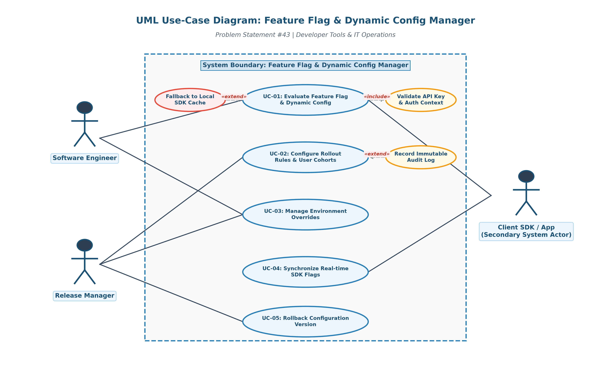
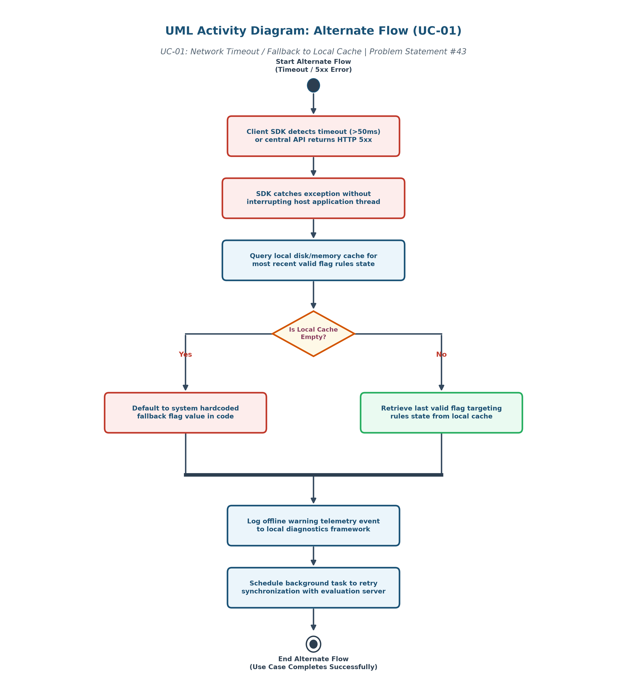

# Software Engineering Lab 1: Requirements Engineering & UML Use-Case Modelling

**Course**: SE Lab 1 — PES University (Dept. of CSE)  
**Problem Statement ID**: #43  
**Domain**: Developer Tools & IT Operations  
**Topic**: Feature Flag & Dynamic Config Manager  

---

## Deliverables Summary

| Deliverable File | Format | Description |
|---|---|---|
| [`Requirements_Table.pdf`](Requirements_Table.pdf) | PDF (`.pdf`) | Requirements Table featuring 5 FRs (FR-001 to FR-005) and 2 NFRs (NFR-001 & NFR-002) with ID, Type, Description, Priority, Acceptance Criteria, Rationale & Comments. |
| [`Use_Case_Diagram.png`](Use_Case_Diagram.png) | Image (`.png`) | Vector UML Use-Case Diagram depicting all 3 actors, 5 primary use cases, boundary box, `«include»`, and `«extend»` stereotypes. |
| [`Use_Case_Flow_Specification.pdf`](Use_Case_Flow_Specification.pdf) | PDF (`.pdf`) | 1-page Use-Case Flow Specification document for core use case `UC-01: Evaluate Feature Flag & Dynamic Config`. |
| [`Alternate_Flow_Activity_Diagram.png`](Alternate_Flow_Activity_Diagram.png) | Image (`.png`) | UML Activity Diagram illustrating the step-by-step logic of the Cache Fallback alternate flow. |
| [`Alternate_Flow_Activity_Diagram.pdf`](Alternate_Flow_Activity_Diagram.pdf) | PDF (`.pdf`) | PDF vector export of the UML Activity Diagram. |
| [`Exception_Flow_Specification.pdf`](Exception_Flow_Specification.pdf) | PDF (`.pdf`) | PDF version of the Exception Use-Case Flow Specification document detailing HTTP 401, 403, and 500 exceptions. |
| [`Exception_Flow_Specification.docx`](Exception_Flow_Specification.docx) | Word (`.docx`) | Word document version of the Exception Use-Case Flow Specification. |
| [`43_SE_Lab1_SE_Problem_Statements (1).pdf`](43_SE_Lab1_SE_Problem_Statements%20%281%29.pdf) | PDF (`.pdf`) | Original Lab 1 Problem Statement #43 document. |

---

## 1. System Requirements Table

### Functional Requirements (FR)
- **FR-001 [High]**: *User Cohort Flag Evaluation* — Evaluate user targeting rules (User ID hash, Beta cohort) and return accurate boolean feature flag states. *(Given Sample)*
- **FR-002 [High]**: *Percentage-Based Rollout Configuration* — Allow Release Managers to configure percentage-based rollout rules for specified application environments.
- **FR-003 [High]**: *Environment-Specific Config Overrides* — Allow Software Engineers to define environment overrides (Development, Staging, Production).
- **FR-004 [Medium]**: *Real-time SDK Synchronization* — Push real-time flag update notifications to connected Client SDKs via SSE or WebSockets.
- **FR-005 [Medium]**: *Audit Logging & Version Rollback* — Maintain immutable audit trail of config changes and support zero-downtime rollback to prior versions.

### Non-Functional Requirements (NFR)
- **NFR-001 [High, Performance & Security]**: *Low Latency Flag Evaluation* — Flag evaluation API must execute in under 15 ms (p99) to minimize overhead in client critical paths. *(Given Sample)*
- **NFR-002 [High, Availability & Fault Tolerance]**: *99.99% Uptime & SDK Local Cache Fallback* — SDK falls back to cached local rules during network partition events without throwing unhandled exceptions.

---

## 2. UML Use-Case Diagram Overview

### Actors:
1. **Software Engineer** (Primary Actor)
2. **Release Manager** (Primary Actor)
3. **Client SDK / Application** (Secondary System Actor)

### Use Cases:
- **UC-01**: Evaluate Feature Flag & Dynamic Config
- **UC-02**: Configure Rollout Rules & User Cohorts
- **UC-03**: Manage Environment Overrides
- **UC-04**: Synchronize Real-time SDK Flags
- **UC-05**: Rollback Configuration Version

### Stereotype Relationships:
- `UC-01` includes `Validate API Key & Auth Context` (`«include»`)
- `Fallback to Local SDK Cache` extends `UC-01` (`«extend»`) on network failure
- `Record Immutable Audit Log` extends `UC-02` (`«extend»`)

---

## 3. Use-Case Flow Specification (UC-01)

- **Main Success Scenario**:
  1. Client SDK sends evaluation request (`flag_key`, `user_id`, `attributes`).
  2. System validates API key and environment permissions.
  3. System retrieves active feature flag targeting rules.
  4. System evaluates environment overrides.
  5. System evaluates user attribute targeting rules.
  6. System hashes `user_id` using consistent hashing algorithm for percentage rollout bucket.
  7. System determines effective boolean flag state (`true`/`false`).
  8. System caches evaluated state in edge Redis memory store.
  9. System returns HTTP 200 OK with evaluated flag payload.
  10. Client SDK receives response and host app executes feature branch.

- **Alternate Flow (2a: Network Timeout / Cache Fallback)**:
  2a1. Client SDK detects network socket timeout (>50ms).  
  2a2. SDK catches exception without interrupting host execution.  
  2a3. SDK retrieves last valid flag state from local disk/memory cache.  
  2a4. If cache empty, SDK uses developer hardcoded fallback value.  
  2a5. SDK logs offline warning telemetry and schedules background retry.  
  2a6. Use case completes with fallback state.

---

## 4. Alternate Flow UML Activity Diagram

The activity diagram models the detailed control flow and functional activities triggered by Alternate Flow **2a (Network Timeout / Fallback to Local Cache)**. It documents:
- Exception handling boundaries for Client SDK.
- Sequential cache query execution.
- Diamond-decision branch checking if the local cache is empty.
- Fallback value assignment vs. cached configuration loading.
- System merging activities to log telemetry and schedule background retry threads.

---

## 5. Exception Flow Specifications

Detailed specs for when preconditions fail or system errors prevent successful evaluations:

### Exception Flow 1b (HTTP 401): Invalid or Expired API Key
- **1b1.** Client SDK sends evaluation request with an expired or invalid API key.
- **1b2.** System fails validation check of client API key in the auth database.
- **1b3.** System logs an authentication failure security event with metadata.
- **1b4.** System returns HTTP 401 Unauthorized with error payload.
- **1b5.** Client SDK catches 401 error, throws a fatal initialization exception to the host application, and the use case terminates.

### Exception Flow 1c (HTTP 403): Environment Access Denied
- **1c1.** Client SDK sends evaluation request targeting a specific restricted environment (e.g. Production).
- **1c2.** System determines that the API key scope is limited to Development or Staging only.
- **1c3.** System logs environment access authorization violation alert.
- **1c4.** System returns HTTP 403 Forbidden with access restriction error payload.
- **1c5.** Client SDK catches 403 response, logs permissions failure telemetry, falls back to the hardcoded developer default, and terminates.

### Exception Flow 1d (HTTP 500 & Empty Cache): Database Outage & Empty Cache
- **1d1.** Client SDK sends evaluation request payload.
- **1d2.** System database queries fail (database service offline / internal timeouts).
- **1d3.** Redis backup memory cache queries fail, returning HTTP 500 Internal Server Error to the SDK.
- **1d4.** Client SDK detects HTTP 500 and queries its local disk/memory rules cache.
- **1d5.** Client SDK determines that the local rules cache is empty (first-time application boot).
- **1d6.** SDK applies the hardcoded developer fallback value, logs a critical system failure warning to local diagnostics, schedules background sync retry task, and terminates.
